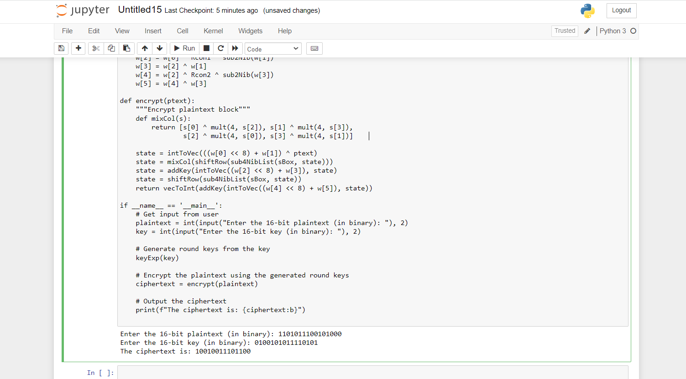

# S-AES

Sage Tool to implement the Simplified AES that takes input from users
Note*: this's an edited version of santa clara  university  S-AES made by DR.Joao H de A Franco
https://jhafranco.com/2012/02/11/simplified-aes-implementation-in-python/
